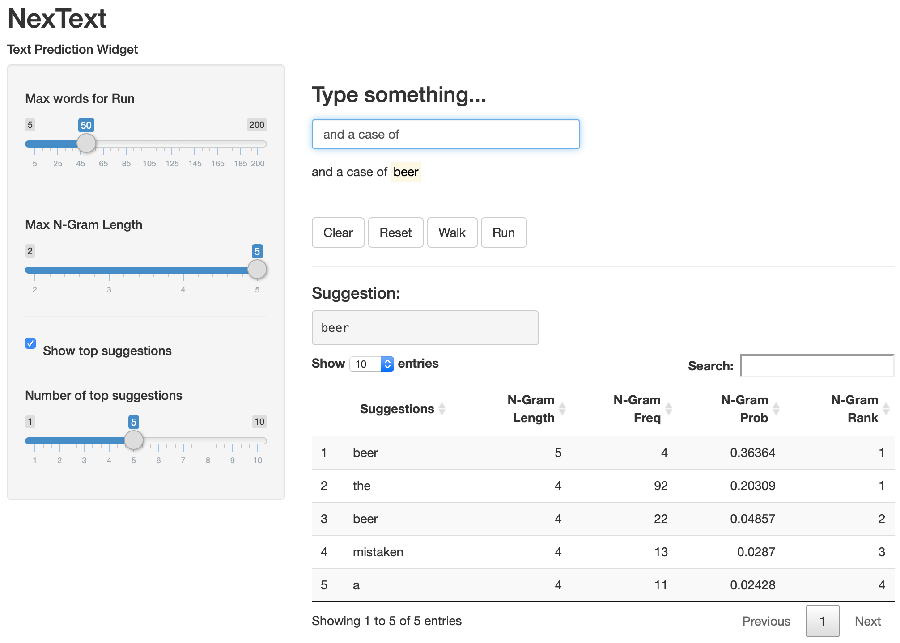

```{r setup, include=FALSE}
library(knitr)
knitr::opts_chunk$set(echo = FALSE, eval=TRUE)
```

```{r libraries, message=FALSE, warning=FALSE}
library(kableExtra)
library(data.table)
library(quanteda)
library(ggplot2)
```

```{r load_data}
dic<-readRDS("./dic.RDS")
ng<-readRDS("./ngramTOP.RDS")
ngmas<-readRDS("./ngramMASTER.RDS")
dic<-dic[order(rank)]
setkey(dic,rank)
cum50 <- dic[cdf >= 0.50, min(rank)]
cum90 <- dic[cdf >= 0.90, min(rank)]
cum95 <- dic[cdf >= 0.95, min(rank)]
dicplot<-dic[,.(rank,cdf*100)]
colnames(dicplot)<-c("rank","cdf")
source('ng_predict_app.R')
```

## Methodology: Dictionary and N-Gram Processing
The objective of this project is to create a text prediction model/algorithm and shiny application - **NexText** - to perform text prediction, using a "corpus" of 3 documents as a source for training data - extracts from blogs, news and twitter.

Following is the pre-processing methodology used to construct the N-gram model used in NexText:

```{r method1_table}
table1 <- data.table(c(1:7),
                c("Corpus files merged and randomly assigned to 10 stripes of data to enable processing.  Eventually, 90% of the corpus was used for training the model.",
                  "Quanteda used to process the corpus to generate tokens (words), coverting to lower case and removing punctuation, symbols, twitter hashtags/handles, numbers and URLs.",
                  "Summarized unique words (~770k) to a master dictionary, ranked by frequency and pruned to population of words which cover 95% of corpus (~20k words).  Rank is used as the index lookup for each word (e.g. 'the' is index 1).",
                  "N-Grams with n=1:5 generated using Quanteda, and N-gram string deconstructed to a sequence of index lookups against the dictionary for each word, to reduce memory required.  Only N-grams consisting of valid dictionary lookups are retained.",
                  "Calculate estimated probability for each N-gram using Maximum Likelihood Estimation approach i.e. the observed frequency of the N-gram divided by the observed frequency of its prefix (N-1 words).",
                  "Prune final population by removing all N-grams with frequency 1 (which significantly reduces the high volume of higher complexity N-grams), and only retain top 5 ranked N-grams.",
                  "All processing is performed using Data Tables, with final output files for dictionary (dic.RDS - 336kb) and N-gram rankings (ngramTOP.RDS - 56mb) deployed with the shiny app."
                )
)

table1 %>% kable(
                col.names=c("","Description"),
                row.names=F,booktabs=T,align=c("c","l")) %>%
                kable_styling(bootstrap_options = c("condensed"),
                              latex_options = "hold_position",
                              full_width=F,position='center') %>%
                row_spec(0,bold=T)
                
```

Note: stopwords were included in the dictionary and N-grams.  The code was written to remove stopwords to analyze this option, but not found to be beneficial.

## Methodology: Dictionary & N-Gram Statistics

The following chart shows the CDF curve for the corpus coverage by features (unique words) in the corpus.  It shows the 50%, 90% and 95% quantiles, with 95% coverage at `r cum95` words:

```{r cdf, fig.height=4, fig.width=4, fig.align = "center"}
#-------------------------------------------------------------------------------------
# Plot CDF for Dictionary
theme_set(theme_bw())

g1 <- ggplot(dicplot,aes(x=rank,y=cdf)) +
        geom_line() +
        geom_segment(mapping=aes(x=0,xend=cum50,y=50,yend=50),
                     linetype="dotted",color="red") +
        geom_segment(mapping=aes(x=cum50,xend=cum50,y=0,yend=50),
                     linetype="dotted",color="red") +
        geom_text(aes(x=cum50, label=paste0(cum50," words, 50%"), y=50),
                  color="red", nudge_x=1000, hjust=1, angle=90) +
        geom_segment(mapping=aes(x=0,xend=cum90,y=90,yend=90),
                     linetype="dotted",color="red") +
        geom_segment(mapping=aes(x=cum90,xend=cum90,y=0,yend=90),
                     linetype="dotted",color="red") +
        geom_text(aes(x=cum90, label=paste0(cum90," words, 90%"), y=88), 
                  color="red", nudge_x=-1000, hjust=1, angle=90) +
        geom_segment(mapping=aes(x=0,xend=cum95,y=95,yend=95),
                     linetype="dotted",color="red") +
        geom_segment(mapping=aes(x=cum95,xend=cum95,y=0,yend=95),
                     linetype="dotted",color="red") +
        geom_text(aes(x=cum95, label=paste0(cum95," words, 95%"), y=93),
                  color="red", nudge_x=-1000, hjust=1, angle=90) +
        ylim(0,100) +
        xlim(0,cum95) +
        ylab("Corpus Coverage %") +
        xlab("Number of Words")
print(g1)

```

The following table shows the N-gram statistics during pre-processing, with reduction of volume from `r round(ngmas[,.N]/1000000,1)` million N-grams to `r round(ng[,.N]/1000000,1)` million, by removing N-grams which only occurred once, and taking the top 5 most likely N-gram outcomes for each prefix.

```{r ngram_stats}
ngresults <- data.table(
                c(1:5,"Total"),
                c(ngmas[,.N,by=ngram_len][order(ngram_len),N],
                        ngmas[,.N]),
                c(ngmas[ngram_freq>1,.N,by=ngram_len][order(ngram_len),N],
                        ngmas[ngram_freq>1,.N]),
                c(ng[,.N,by=ngram_len][order(ngram_len),N],
                        ng[,.N])
)

ngresults %>% kable(
                col.names=c("N-gram Length","Valid N-Grams","Freq > 1", 
                            "Freq > 1 & Rank <=5"),
                row.names=F,
                booktabs=T,format.args=list(big.mark = ','),
                align=c("c",rep("r",3)),digits=c(0,0,0,0)) %>%
                kable_styling(bootstrap_options = c("condensed"),
                              latex_options = "hold_position",
                              full_width=F,position='center') %>%
                row_spec(c(0,6),bold=T) %>%
                column_spec(c(1:4),border_right=T,border_left=T,width="13em")
```


## Methodology: Prediction Function

The function **ng_predict_app()** takes a phrase and returns either a list of predictions (to support benchmarking), or grid of the full prediction data (used by the shiny app).  The function assumes the dictionary and N-gram data tables are already loaded.  The steps are as follows:

```{r method2_table}
table2 <- data.table(c(1:6),
                c("Scrub the given phrase using the same Quanteda functions as the N-gram processing i.e. convert to lower case, and remove symbols, punctuation, twitter, numbers and URLs",
                  "Convert scrubbed phrase to list of dictionary IDs to facilitate N-gram lookup",
                  "Build results table for N-grams for n=5,4,3,2,1 (starting less than 5, if given phrase is shorter than 4 words); for each n, the associated prefix {n-1} words are looked up in the N-gram file, to select all suggestions for the nth word",
                  "For Unigrams (n=1) which have no prefix, the result will be the top 5 words (the,to,and,a,of) as default",
                  "The results are sorted by decreasing N-gram length, then increasing rank (i.e. highest probability first)",
                  "The top number of choices specified in the function call are returned either as a list of words, or table of attributes"
                )
)

table2 %>% kable(
                col.names=c("","Description"),
                row.names=F,booktabs=T,align=c("c","l")) %>%
                kable_styling(bootstrap_options = c("condensed"),
                              latex_options = "hold_position",
                              full_width=F,position='center') %>%
                row_spec(0,bold=T)
```

Examples:

```{r ngram_example, echo=TRUE}
ng_predict_app("and a case of",choices=8)               # choices > 0 returns table
ng_predict_app("from the bottom of my",choices=-3)      # choices < 0 returns list of next_word only
```


## NexText App
```{r widget_screenshot, out.width = "800px", fig.align="center"}

```

Typing a phrase automatically generates a prediction and adds it to a display of the complete sentence.

Clicking **Walk** will accept the current top prediction and get the next prediction (keep clicking Walk to extend the sentence).

Clicking a suggestion in the grid will use that word instead of the top prediction, and get the next prediction.

Clicking **Run** will automatically generate words, up to the maximum number of words set by the slider on the left.

## NexText App Functionality

The following further describes the parameters and functionality available to the user (Help tab is provided in the app):

```{r param_table}
table3 <- data.table(
                c("Max Words for Run",
                  "Max N-Gram Length",
                  "Show Top Suggestions",
                  "Number of Top Suggestions",
                  "Clear","Reset","Walk","Run"
                  ),
                c("Maximum sentence length to generate after clicking Run",
                  "Maximum N-Gram length to include in prediction.  Higher N provides more accuracy and coherence",
                  "Whether to show the top suggestion grid.  Automatically turned off during a Run sequence for performance",
                  "How many suggestions from the prediction to display, or use during the random selection in a Run sequence",
                  "Clear input box to start over, leave parameters unchanged",
                  "Clear input box to start over, reset parameters to default values",
                  "Run the prediction and append the top choice word to the input box",
                  "Loops the prediction with random selection of top specified # of suggestions, up to specified Max Words for Run"
                )
)

table3 %>% kable(
                col.names=c("Parameter/Function","Description"),
                row.names=F,booktabs=T,align=c("l","l")) %>%
                kable_styling(bootstrap_options = c("condensed"),
                              latex_options = "hold_position",
                              full_width=F,position='center') %>%
                row_spec(0,bold=T)
                
```

Link to widget:

https://ringspagit.shinyapps.io/NexText/
